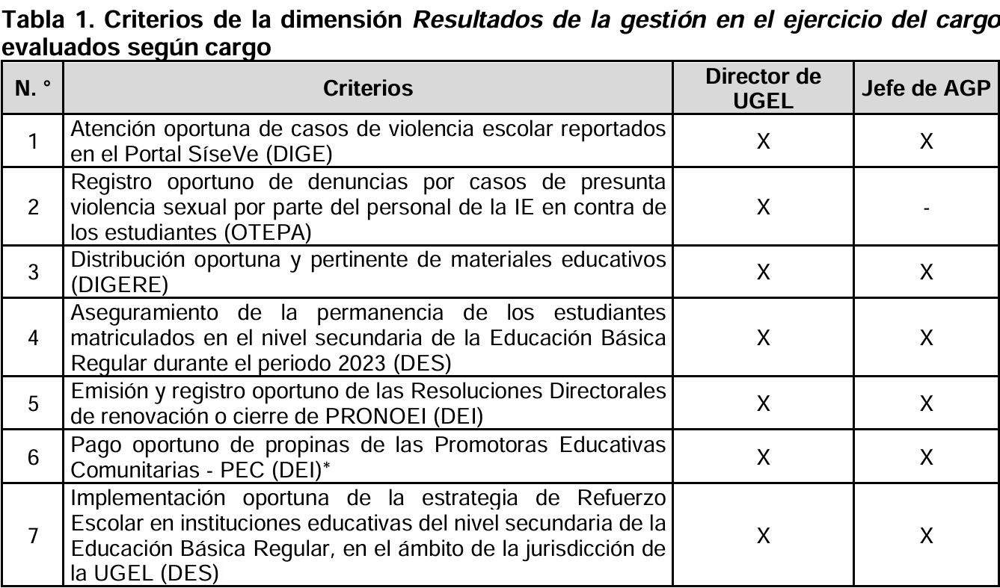
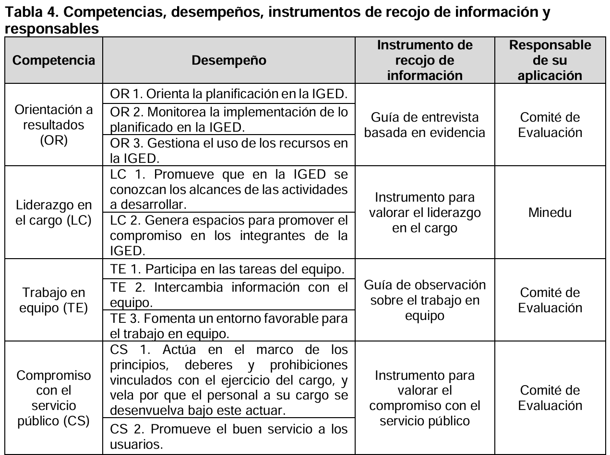

# MINEDU-2026-05-INFOGRAFIA-EDDIR-DRE-UGEL-2023-2024

## Marco normativo

#### Definiciones

**AGP**: Área de Gestión Pedagógica.

**UGEL**: Unidad de Gestión Educativa Local

**IGED**: Instancia de Gestión Educativa Descentralizada.

#### Modelo de evaluación

La Evaluación del Desempeño en cargos directivos de UGEL se realiza a partir de **dos dimensiones** que aplican tanto para el cargo de director de UGEL como para el jefe de AGP, las cuales son:

1. **Resultados de la gestión en el ejercicio del cargo:**

   La evaluación de esta dimensión consiste en la **determinación del cumplimiento de los criterios de evaluación sobre procesos que se consideran prioritarios** en la gestión del directivo, para lo cual se toma como base la información recolectada por los sistemas del Minedu y las metas establecidas por las áreas responsables de determinar su cumplimiento.

   

   *Este criterio no es considerado en la evaluación del Director de UGEL operativa
2. **Competencias transversales en el ejercicio del cargo**

   Evalúa las competencias que el directivo despliega durante el cumplimiento de sus funciones. La evaluación de esta dimensión se realiza a partir de la valoración de comportamientos observables que el directivo pone en práctica en el desempeño del cargo en el que ha sido designado.

   En la presente evaluación se valoran cuatro (4) competencias:

   **Orientación a resultados (OR):** La guía de entrevista basada en evidencia recoge información para evaluar los tres (3) desempeños de la competencia Orientación a resultados (OR)

   **Liderazgo en el cargo (LC):** El instrumento para valorar el liderazgo en el cargo, permite valorar el desempeño del directivo con relación a los dos (2) desempeños de la competencia Liderazgo en el cargo (LC). Consiste en aplicar una encuesta al personal cuyo trabajo se encuentra vinculado a cada cargo directivo evaluado. Para el caso del jefe de AGP de la UGEL, se considera al personal pedagógico del área de gestión pedagógica

   **Trabajo en equipo (TE):** La guía de observación sobre el trabajo en equipo recoge información sobre los tres (3) desempeños de la competencia Trabajo en equipo (TE) que el directivo pone en práctica en la realización de actividades con
   personal de la IGED. Consiste en observar al directivo en dos (2) actividades en las que trabaja en equipo con otros integrantes de la IGED para organizar, planificar, implementar o evaluar actividades relacionadas con la provisión del servicio educativo en la jurisdicción, tales como la distribución de materiales educativos, el acondicionamiento de los locales educativos, a contratación docente, el aseguramiento de la matrícula de los estudiantes, el fortalecimiento docente, entre otros. La aplicación de este instrumento está a cargo del Comité de Evaluación.

   **Compromiso con el servicio público (CS).** Instrumento para valorar el compromiso con el servicio público, permite valorar los dos (2) desempeños de la competencia Compromiso con el servicio público (CS). Consiste en el recojo y valoración de información vinculada a los dos (2) desempeños de la referida competencia, la misma que proviene de fuentes confiables como reportes de sistemas de información, documentación generada en la UGEL durante la atención de los usuarios, documentación generada en las acciones de difusión o capacitación sobre una cultura de ética e integridad, entrevistas a directivos de IE de la jurisdicción de la UGEL, etc.

   

#### Condiciones para aprobar la evaluación

Aprueban la evaluación los directivos evaluados que cumplen las siguientes condiciones:

1. Tener un puntaje final igual o superior a 2,60.
2. Haber prestado efectivamente el servicio, según lo estipulado en el artículo 62
   del Reglamento.
3. No obstruir el recojo de información [Se considera obstrucción del recojo de la información a los **comportamientos** realizados por el directivo evaluado que **frustran la aplicación de los instrumentos de evaluación de la dimensión Competencias transversales** en el ejercicio del cargo y que conllevan a que éste no cuente con calificación para los desempeños que se valoran en el respectivo instrumento, sin que ello signifique que no sean considerados en el cálculo del puntaje de esta dimensión. Además, generan la desaprobación de la evaluación]

## Información a partir de la data

Cruce de la variable CondicionFinal y SeRealizoEvaluacion:

| CondicionFinal                                                       | No | Sí | All |
| -------------------------------------------------------------------- | -- | --- | --- |
| Aprobado                                                             | 0  | 178 | 178 |
| Desaprobado                                                          | 0  | 21  | 21  |
| No evaluado por renuncia formal al cargo en el que ha sido designado | 4  | 0   | 4   |
| All                                                                  | 4  | 199 | 203 |

Cruce de la variable CondicionFinal y DesempenoEfectivo:

| CondicionFinal                                                       | - | No | Sí | All |
| -------------------------------------------------------------------- | - | -- | --- | --- |
| Aprobado                                                             | 0 | 0  | 178 | 178 |
| Desaprobado                                                          | 0 | 7  | 14  | 21  |
| No evaluado por renuncia formal al cargo en el que ha sido designado | 4 | 0  | 0   | 4   |
| All                                                                  | 4 | 7  | 192 | 203 |
